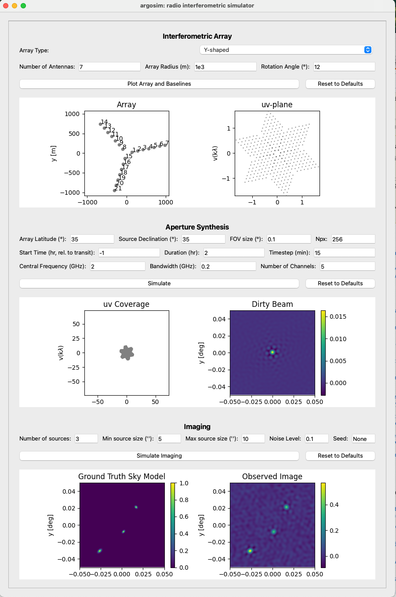

# argosim-GUI
This repository provides a graphical user interface for the argosim package.

## How to run
1. Clone the repository:
    ```bash
    git clone https://github.com/CentofantiEze/argosim-GUI.git
    cd argosim-GUI
    ```
2. Install the required dependencies:
    ```bash
    conda env create -f environment.yml
    conda activate argosim-GUI
    ```
3. Run the application:
    ```bash
    python src/argosim-gui.py
    ```
## Graphical User Interface


*Screenshot of the argosim-GUI main window.*